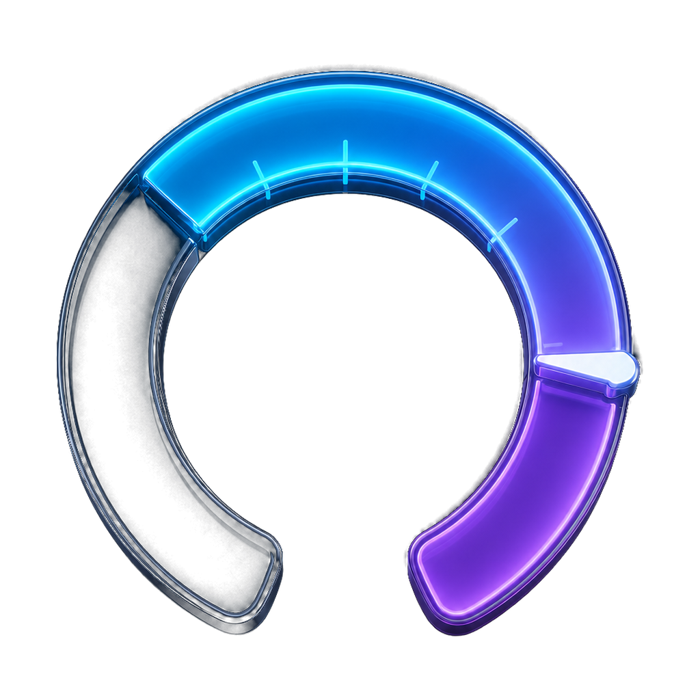

# Taskmetry



Taskmetry は、Windows のタスクバーに CPU・メモリ・AI サービスの公式使用枠を常時表示する軽量メーターです。

公式サイトは [taskmetry.kagayoi.com](https://taskmetry.kagayoi.com/) です。サイトのソースは [../vps-web/lp/taskmetry/index.html](../vps-web/lp/taskmetry/index.html) にあります。

中央のタスクアイコン群と通知領域の間にある実際の空きスペースを検出し、既存アイコンを覆わない幅へ自動調整します。空きが 260px 未満ならタスクバー外側へ退避し、Explorer が再起動した場合も再検出して追従します。

タスクバーの上・下・左・右を自動判定し、向きに合わせて横型／縦型メーターを切り替えます。通常はクリック透過の「固定表示モード」で誤操作を防ぎ、設定から「レイアウト編集モード」にした場合だけドラッグできます。

設定の「アイコン群の左右に分割して表示」をONにすると、スタートボタンとピン留めアイコンを挟んで左右 2 本のレールへメーターを振り分けられます。左レールはアイコン群の直前、右レールは通知領域の直前へ寄るので、ウィジェットボタンや通知アイコンを覆いません。各メーターの配置は個別に選べ、既定では CPU・RAM を左、AI 使用率を右にします。縦置きタスクバーでは左がアイコン群より上、右がアイコン群より下です。表示幅は左右のメーター数で按分され、分割中は位置ドラッグを使いません。

## 表示できる情報

| 項目 | 内容 |
|---|---|
| CPU | システム全体の CPU 使用率 |
| RAM | 物理メモリの使用率と使用量 |
| Codex | OpenAI 公式アカウントAPIの利用枠。複数の時間枠とリセット時刻をツールチップに表示 |
| Claude | `claude.ai` の公式Web使用率応答から5時間・7日・モデル別の利用枠を表示 |
| Gemini | 個人アカウント向け公式使用率APIが提供されるまで `—` と理由を表示 |

Codex は設定画面の「Webで接続」からOpenAIアカウントへ認証します。Taskmetryは公式の `codex app-server` を介して使用率を60秒ごとに取得し、認証トークンを受け取ったり保存したりしません。

- ローカルの会話、セッションログ、CLI出力は読み取りません。
- Claudeは、ユーザーが手動で入力した `sessionKey` を使って `claude.ai` の公式Web使用率応答を取得します。非公開のWebエンドポイントを利用するため、Claude側の変更で一時的に取得できなくなる場合があります。
- Claudeの `sessionKey` は設定JSONやログへ保存せず、接続確認の成功後にWindows資格情報マネージャーへ保存します。Geminiは個人向け公式使用率APIが公開されていないため推測しません。
- Codex連携には、`codex app-server` を利用できるCodexのインストールが必要です。

CPU・メモリの計測値、会話本文、ローカルログは外部へ送信しません。Codex接続時はOpenAIの認証画面と公式使用率APIへ、Claude接続時は `claude.ai` の組織・使用率エンドポイントへ通信します。Velopackでインストールした場合は、起動時と「更新を確認」の操作時に `taskmetry.kagayoi.com` へHTTPSで更新情報を問い合わせます。

## 使い方

1. [Windows 版セットアップ](https://taskmetry.kagayoi.com/Taskmetry-win-Setup.exe)をダウンロードして起動します。
2. 初回に開く設定画面で、Codexの「Webで接続」と表示項目・幅・更新間隔を設定します。
3. 通知領域の Taskmetry アイコンから、いつでも設定画面を開けます。
4. 位置を変える場合は「レイアウト編集モード」を ON にしてレールをドラッグし、調整後に OFF へ戻します。

### Claudeを接続する

1. [claude.ai](https://claude.ai/)へログインし、開発者ツールの Application（FirefoxはStorage）→ Cookies → `https://claude.ai` を開きます。
2. `sessionKey` 行にある `sk-ant-sid01-` で始まる値だけをコピーします。
3. Taskmetryの設定にある「CLAUDE // WEB SESSION」へ貼り付け、「Session Tokenで接続」を選びます。

`sessionKey` はClaudeアカウントへアクセスできるパスワード同等の秘密情報です。共有やスクリーンショットへの写り込みを避け、漏えいが疑われる場合はClaudeからログアウトして無効化してください。Taskmetryで「接続を解除」を選ぶと、Windows資格情報マネージャーに保存した値も削除します。

Web認証が必要な場合や、公式APIが提供されていない場合は `—` と表示します。ツールチップでは、認証待ち・仕様変更・一時的な接続失敗などの理由を確認できます。

設定ファイルが一時的に読み取れない場合は既存設定を保護するため保存を停止し、JSONが破損している場合は退避コピーを作成してから既定値で起動します。

## 動作環境

- Windows 10 以降
- x64
- ソースから実行する場合は .NET 10 SDK

現時点ではメインタスクバーを対象にしています。将来の Windows 11 で上下左右配置が提供された場合も、タスクバー矩形とモニター端の関係から追従する設計です。

## ソースから起動

```powershell
dotnet run --project src/Taskmetry/Taskmetry.csproj
```

配布用の自己完結版を作る場合:

```powershell
dotnet publish src/Taskmetry/Taskmetry.csproj -c Release -r win-x64 --self-contained -o publish
```

署名付きリリースは SimplySign Desktop へ接続後、次のスクリプトで作成します。通常は `vava` Skill から呼び出します。

```powershell
pwsh -NoProfile -File scripts/release-local.ps1
```

詳しい開発コマンドは [CONTRIBUTING.md](CONTRIBUTING.md) を参照してください。
変更履歴は [CHANGELOG.md](CHANGELOG.md)、Cloudflare の構成は [../vps-web/lp/README.md](../vps-web/lp/README.md)、Microsoft Store 提出用の原稿は [store/README.md](store/README.md) にあります。

## ライセンス

[MIT License](LICENSE)
